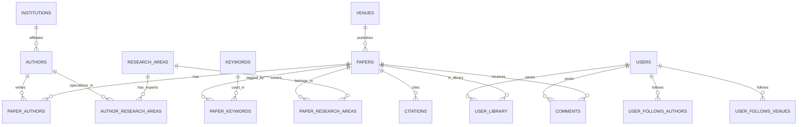

# ScholarDemon - Academic Paper Management System

A comprehensive full-stack Database Management System (DBMS) project inspired by Google Scholar, built with the PERN stack (PostgreSQL, Express.js, React.js, Node.js).


## 🎯 Features

### Core Functionality

- **Paper Management**: Browse, search, and discover academic papers with advanced filtering
- **Author Profiles**: View detailed author information including h-index, citations, and publications
- **Citation Tracking**: Full citation network with citing and cited papers
- **Personal Library**: Save papers, add notes, and rate your readings
- **Follow System**: Follow authors and venues to get personalized feeds
- **Comments**: Threaded discussions on papers
- **Advanced Search**: Full-text search with filters by year, venue, author, and keywords

### Technical Features

- JWT-based authentication with role-based access control
- Real-time citation count updates via database triggers
- Automatic h-index calculation
- Full-text search using PostgreSQL's tsvector
- RESTful API with comprehensive error handling
- Responsive UI with styled-components
- Rate limiting and security headers
- Database views for optimized queries

## 📋 Table of Contents

- [Prerequisites](#prerequisites)
- [Installation](#installation)
- [Database Setup](#database-setup)
- [Running the Application](#running-the-application)
- [API Documentation](#api-documentation)
- [Project Structure](#project-structure)
- [Testing](#testing)
- [Deployment](#deployment)
- [Troubleshooting](#troubleshooting)

## 🔧 Prerequisites

Before you begin, ensure you have the following installed:

- **Node.js** (v16 or higher) - [Download](https://nodejs.org/)
- **PostgreSQL** (v12 or higher) - [Download](https://www.postgresql.org/download/)
- **npm** or **yarn** package manager
- **Git** (optional, for cloning)

## 📦 Installation

### 1. Clone or Download the Project

```bash
git clone <repository-url>
cd ScholarDemon
```

### 2. Install Backend Dependencies

```bash
npm install
```

### 3. Install Frontend Dependencies

```bash
cd frontend
npm install
cd ..
```

### 4. Environment Configuration

Create a `.env` file in the root directory:

```bash
cp .env.example .env
```

Edit `.env` with your configuration:

```env
# Database Configuration
DB_HOST=localhost
DB_PORT=5432
DB_NAME=scholardemon
DB_USER=postgres
DB_PASSWORD=your_password

# JWT Configuration
JWT_SECRET=your_super_secret_jwt_key_change_this_in_production
JWT_EXPIRE=7d

# Server Configuration
PORT=5000
NODE_ENV=development

# CORS Configuration
CLIENT_URL=http://localhost:3000
```

## 🗄️ Database Setup

### 1. Create PostgreSQL Database

```bash
# Login to PostgreSQL
psql -U postgres

# Create database
CREATE DATABASE scholardemon;

# Exit psql
\q
```

### 2. Run Migrations

```bash
npm run db:migrate
```

This will create all tables, indexes, triggers, and views.

### 3. Seed Sample Data (Optional)

```bash
npm run db:seed
```

This populates the database with:

- 5 institutions
- 10 authors
- 8 venues
- 20 papers
- Citations, keywords, and relationships
- 5 sample users (password: `password123`)
  - Admin: john@example.com
  - Users: jane@example.com, alice@example.com, bob@example.com, carol@example.com

## 🚀 Running the Application

### Development Mode

Run both backend and frontend concurrently:

```bash
npm run dev
```

Or run separately:

**Backend only:**

```bash
npm run server
```

**Frontend only:**

```bash
npm run client
```

### Access the Application

- **Frontend**: http://localhost:3000
- **Backend API**: http://localhost:5000
- **Health Check**: http://localhost:5000/health

## 📚 API Documentation

### Authentication Endpoints

#### Register User

```http
POST /api/auth/register
Content-Type: application/json

{
  "name": "John Doe",
  "email": "john@example.com",
  "password": "password123"
}

Response: 201 Created
{
  "user": { "user_id": 1, "name": "John Doe", "email": "john@example.com" },
  "token": "jwt_token_here"
}
```

#### Login

```http
POST /api/auth/login
Content-Type: application/json

{
  "email": "john@example.com",
  "password": "password123"
}

Response: 200 OK
{
  "user": { "user_id": 1, "name": "John Doe", "email": "john@example.com", "role": "user" },
  "token": "jwt_token_here"
}
```

### Paper Endpoints

#### Search Papers

```http
GET /api/papers/search?q=attention&page=1&limit=20&sort=citations
```

Query Parameters:

- `q`: Search query (searches title and abstract)
- `author`: Filter by author name
- `venue`: Filter by venue name
- `year`: Filter by publication year
- `keyword`: Filter by keyword
- `area`: Filter by research area
- `page`: Page number (default: 1)
- `limit`: Results per page (default: 20, max: 100)
- `sort`: Sort by `relevance`, `citations`, `year`, or `title`

#### Get Paper Details

```http
GET /api/papers/:id
```

#### Get Paper Citations

```http
GET /api/papers/:id/citations?type=citing
```

Parameters:

- `type`: `citing` (papers that cite this) or `cited` (papers cited by this)

### Author Endpoints

#### Get All Authors

```http
GET /api/authors?page=1&limit=20&sort=citations
```

#### Get Author Details

```http
GET /api/authors/:id
```

#### Get Author's Papers

```http
GET /api/authors/:id/papers
```

### Library Endpoints (Authenticated)

#### Get User Library

```http
GET /api/library
Authorization: Bearer <token>
```

#### Add Paper to Library

```http
POST /api/library
Authorization: Bearer <token>
Content-Type: application/json

{
  "paper_id": 1,
  "user_notes": "Important paper on transformers",
  "rating": 5
}
```

#### Update Library Entry

```http
PATCH /api/library/:paperId
Authorization: Bearer <token>
Content-Type: application/json

{
  "user_notes": "Updated notes",
  "rating": 4
}
```

### Follow Endpoints (Authenticated)

#### Follow Author

```http
POST /api/follows/authors/:authorId
Authorization: Bearer <token>
```

#### Get Personalized Feed

```http
GET /api/follows/feed?page=1&limit=20
Authorization: Bearer <token>
```

### Comment Endpoints

#### Get Comments for Paper

```http
GET /api/comments/paper/:paperId
```

#### Add Comment (Authenticated)

```http
POST /api/comments
Authorization: Bearer <token>
Content-Type: application/json

{
  "paper_id": 1,
  "comment_text": "Great paper!",
  "parent_comment_id": null
}
```

## 📁 Project Structure

```
ScholarDemon/
├── backend/
│   ├── db/
│   │   ├── config.js          # Database connection
│   │   ├── schema.sql         # Database schema
│   │   ├── migrate.js         # Migration script
│   │   └── seed.js            # Seed data script
│   ├── middleware/
│   │   ├── auth.js            # Authentication middleware
│   │   ├── errorHandler.js   # Error handling
│   │   └── validators.js     # Input validation
│   ├── routes/
│   │   ├── auth.js            # Auth routes
│   │   ├── papers.js          # Paper routes
│   │   ├── authors.js         # Author routes
│   │   ├── library.js         # Library routes
│   │   ├── comments.js        # Comment routes
│   │   └── follows.js         # Follow routes
│   ├── tests/
│   │   └── api.test.js        # API tests
│   └── server.js              # Express server
├── frontend/
│   ├── public/
│   │   └── index.html
│   ├── src/
│   │   ├── components/        # Reusable components
│   │   │   ├── Header.js
│   │   │   ├── PaperCard.js
│   │   │   ├── SearchBar.js
│   │   │   └── Pagination.js
│   │   ├── pages/             # Page components
│   │   │   ├── Home.js
│   │   │   ├── Login.js
│   │   │   ├── Register.js
│   │   │   ├── Search.js
│   │   │   ├── PaperDetail.js
│   │   │   ├── AuthorDetail.js
│   │   │   ├── Library.js
│   │   │   ├── Feed.js
│   │   │   └── Profile.js
│   │   ├── context/
│   │   │   └── AuthContext.js # Authentication context
│   │   ├── services/
│   │   │   └── api.js         # API service layer
│   │   ├── styles/
│   │   │   └── GlobalStyle.js # Global styles
│   │   ├── App.js             # Main app component
│   │   └── index.js           # Entry point
│   └── package.json
├── .env.example               # Environment template
├── .gitignore
├── docker-compose.yml         # Docker configuration
├── Dockerfile                 # Docker image
├── jest.config.js             # Test configuration
├── package.json
└── README.md
```

## 🧪 Testing

### Run Backend Tests

```bash
npm run test:backend
```

### Run Frontend Tests

```bash
npm run test:frontend
```

### Run All Tests with Coverage

```bash
npm test
```

## 🐳 Docker Deployment

### Using Docker Compose

```bash
# Build and start all services
docker-compose up -d

# View logs
docker-compose logs -f

# Stop services
docker-compose down
```

Services:

- PostgreSQL: localhost:5432
- Backend: localhost:5000
- Frontend: Served by backend in production

### Build Docker Image

```bash
docker build -t scholardemon:latest .
```

## 🌐 Production Deployment

### Heroku Deployment

1. Create Heroku app:

```bash
heroku create scholardemon-app
```

2. Add PostgreSQL addon:

```bash
heroku addons:create heroku-postgresql:hobby-dev
```

3. Set environment variables:

```bash
heroku config:set JWT_SECRET=your_secret_here
heroku config:set NODE_ENV=production
```

4. Deploy:

```bash
git push heroku main
```

5. Run migrations:

```bash
heroku run npm run db:migrate
```

### Vercel Deployment (Frontend Only)

```bash
cd frontend
vercel --prod
```

## 🔒 Security Features

- Password hashing with bcrypt (10 rounds)
- JWT token authentication
- Rate limiting (100 requests per 15 minutes)
- Helmet.js security headers
- CORS protection
- SQL injection prevention via parameterized queries
- Input validation with express-validator
- Role-based access control

## 🐛 Troubleshooting

### Database Connection Issues

**Problem**: Cannot connect to PostgreSQL

```
Error: connect ECONNREFUSED 127.0.0.1:5432
```

**Solutions**:

1. Ensure PostgreSQL is running:

   ```bash
   # Windows
   pg_ctl status

   # Linux/Mac
   sudo service postgresql status
   ```

2. Check credentials in `.env` file
3. Verify database exists:
   ```bash
   psql -U postgres -l
   ```

### Port Already in Use

**Problem**: Port 5000 or 3000 is already in use

**Solution**:

```bash
# Find process using port
# Windows
netstat -ano | findstr :5000

# Linux/Mac
lsof -i :5000

# Kill process or change PORT in .env
```

### Migration Errors

**Problem**: Schema migration fails

**Solution**:

```bash
# Drop and recreate database
psql -U postgres
DROP DATABASE scholardemon;
CREATE DATABASE scholardemon;
\q

# Run migration again
npm run db:migrate
```

### Missing Dependencies

**Problem**: Module not found errors

**Solution**:

```bash
# Clear cache and reinstall
rm -rf node_modules package-lock.json
npm install

# For frontend
cd frontend
rm -rf node_modules package-lock.json
npm install
```

## 📊 Database Schema Diagram



## 🤝 Contributing

Contributions are welcome! Please follow these steps:

1. Fork the repository
2. Create a feature branch (`git checkout -b feature/AmazingFeature`)
3. Commit your changes (`git commit -m 'Add some AmazingFeature'`)
4. Push to the branch (`git push origin feature/AmazingFeature`)
5. Open a Pull Request

## 📝 License

This project is licensed under the MIT License.

## 👥 Authors

- Your Name - Initial work

## 🙏 Acknowledgments

- Inspired by Google Scholar
- Built with the PERN stack
- Uses Material Design principles
- PostgreSQL documentation for advanced features

## 📧 Support

For issues and questions:

- Create an issue on GitHub
- Email: support@scholardemon.com

## 🔮 Future Enhancements

- [ ] PDF parsing and full-text indexing
- [ ] Export citations in BibTeX, RIS formats
- [ ] Email notifications for followed authors
- [ ] Advanced analytics dashboard
- [ ] Machine learning recommendations
- [ ] Social features (share papers, collaborative libraries)
- [ ] Mobile apps (React Native)
- [ ] Integration with external APIs (PubMed, arXiv)

---

**Happy Researching! 📚🎓**
